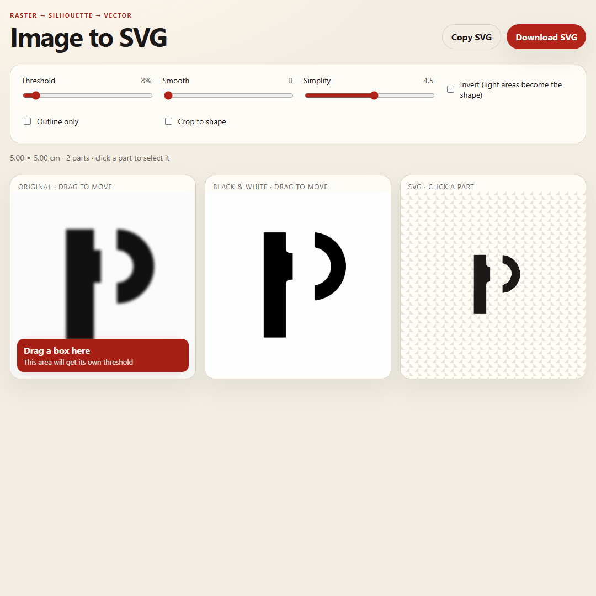

# Image to SVG

A small local web app that turns a photo or logo into a black-and-white silhouette, traces that shape, and exports it as SVG.

## How to use

Open `index.html` in a browser. Then:

1. Drop in a PNG, JPG, or WebP (transparent logos work especially well).
2. Adjust **Threshold** until the black-and-white preview matches the shape you want.
3. Use **Smooth** to soften jagged edges, and **Simplify** to reduce path detail.
4. Check **Invert** if the subject is light on a dark background.
5. Download or copy the SVG.

Everything runs in the browser. No image is uploaded anywhere.

## Controls

- **Outline only** — stroke the silhouette instead of filling it
- **Crop to shape** — trim the SVG viewBox to the traced path
